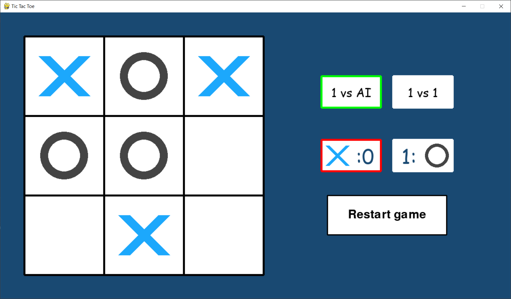
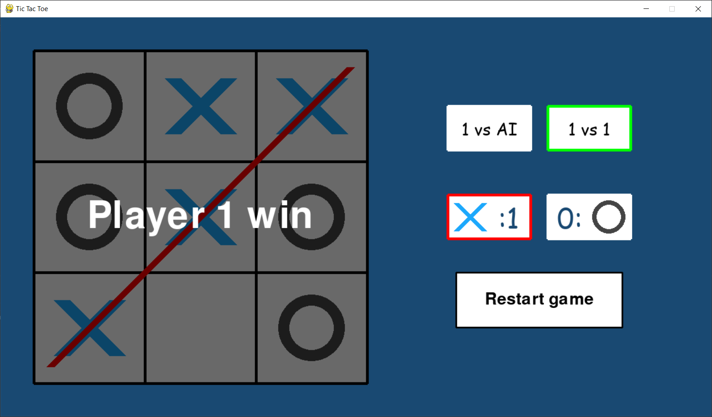

# Tic Tac Toe with AI
> Simple Tic Tac Toe game with two modes, **1 v 1 mode** that you can play with your friends, and a **1 v AI mode**. The AI calculates the best next move using the **minimax algorithm** and **alpha-beta pruning** to speed up search, so it's unbeatable.

# Screenshots

# Requirements
## Windows and Mac
- Install pyhton3: [https://www.python.org/download/releases/3.0/](https://www.python.org/download/releases/3.0/)
- Install pygame: **pip install pygame** (*pip3 install pygame, python3 -m pip install pygame*)
- Run the game: **python main.py** (*python3 main.py*)

## Linux
- Install pyhton3:
  - **sudo apt-get update**
  - **sudo apt-get install python3.6**
- Install pygame: **sudo apt-get install python3-pygame**
- Run the game: **python3 main.py**
